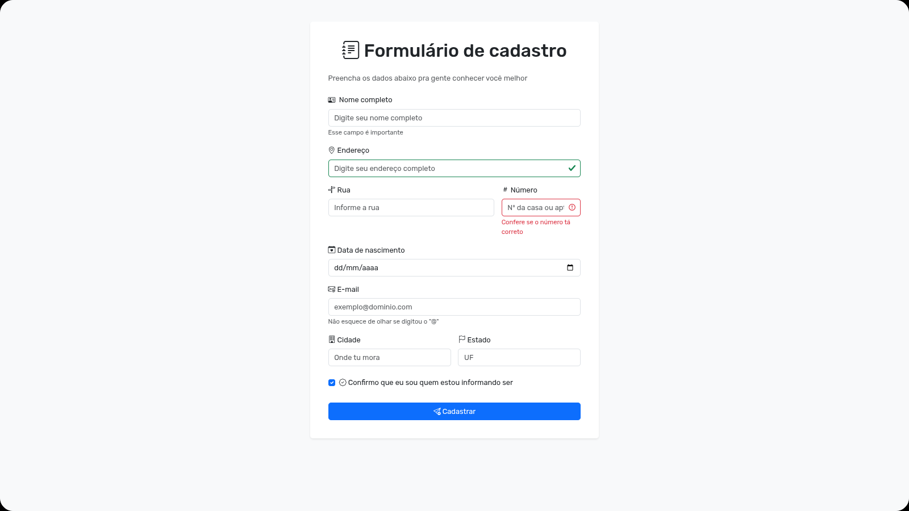
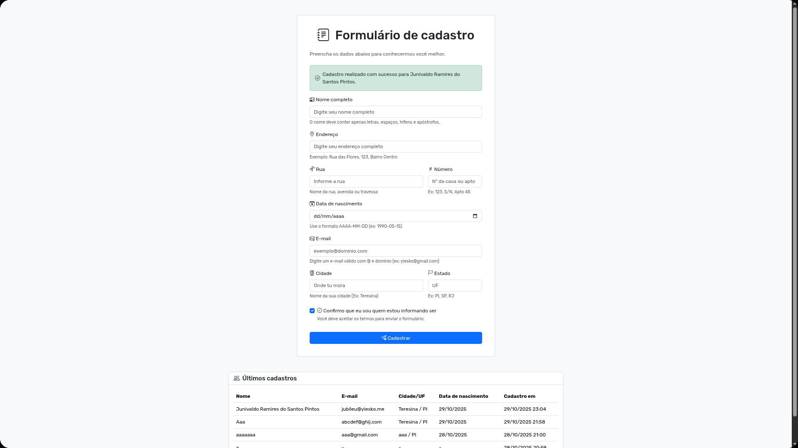

# Formulário de Cadastro

Protótipo de formulário cadastral desenvolvido para a disciplina do Prof. Vinícius (14/10/2025), seguindo para a última fase. O objetivo é executar um fluxo completo de cadastro com validações no backend e renderização server-side.

## Tecnologias utilizadas
- Java 25 com Quarkus e RESTEasy Reactive
- Qute para templating de páginas HTML
- Hibernate ORM com validações Bean Validation
- MariaDB em container Docker para persistência
- Gradle como ferramenta de build

## Como executar rapidamente
- `./gradlew quarkusDev`: inicia o servidor em modo desenvolvimento com hot reload
- `docker-compose up --build`: faz o deploy de MariaDB e a aplicação empacotada
- Ambiente de testes usa H2 em memória; rode `./gradlew test` para validar as regras

## Como testar online
- Acesse [formcad.yiesko.me](https://formcad.yiesko.me) para validar o formulário sem configurar o projeto localmente
- O domínio aponta para a mesma versão do código, então eventuais regressões aparecerão aqui primeiro

## Estrutura do projeto
- `src/main/java`: código de domínio, regras de serviço e camadas web
- `src/main/resources/templates`: páginas Qute (`layout.html` e `form.html`)
- `src/test/java`: cenários de validação para o recurso web

## Visual do formulário

